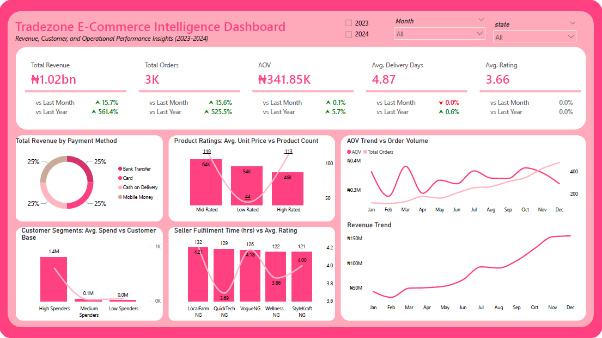
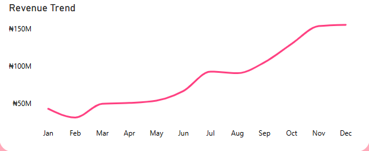
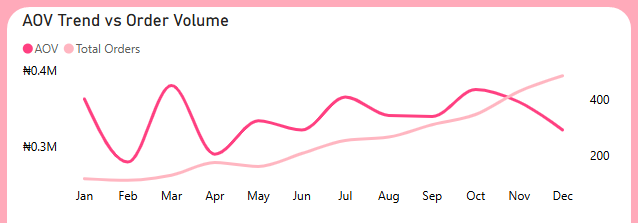
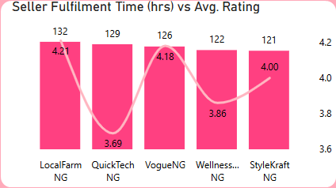

# Tradezone E-Commerce Operations and Customer Analytics

## Background and Overview

Modern e-commerce businesses generate large volumes of transactional and operational data across customers, sellers, products, orders, and payment systems. However, raw transactional data alone provides limited business value unless it is properly cleaned, modeled, and transformed into actionable insights.

This project analyzes the performance of Tradezone, a multi-vendor e-commerce platform, using SQL and Power BI to evaluate revenue growth, customer purchasing behavior, seller operational efficiency, and product performance. The objective was to transform fragmented transactional datasets into an executive-level business intelligence solution capable of supporting operational and strategic decision-making.

The project involved extensive SQL-based data cleaning, multi-table relational modeling, creation of analytical SQL views, DAX-driven KPI development, and interactive Power BI storytelling focused on both financial and operational performance.

---

## Dashboard Preview

- Explore the Dashboard [here](dashboard/tradezone_project.pbix)
---

## Data Structure Overview

The project was built using a relational e-commerce dataset consisting of 7 core transactional tables and 4 analytical SQL views.

### Core Tables

- Customers
- Orders
- Order Items
- Products
- Sellers
- Payments
- Reviews

### Supporting Analytical Views

Custom SQL views were created to simplify analytical reporting and improve Power BI performance by pre-aggregating operational and transactional metrics.

The dataset follows a highly relational structure with interconnected business entities linked through:

- Customer IDs
- Order IDs
- Product IDs
- Seller IDs

This structure enabled cross-functional business analysis across:

- Sales performance
- Product intelligence
- Customer behavior
- Seller operations
- Delivery efficiency
- Payment trends

### Data Cleaning & Transformation

Several data quality issues were addressed during preprocessing, including:

- Revenue recalculation using transactional joins
- Missing price imputation from product tables
- Dropping NULLS in columns where missing records represented less than 5% of the dataset
- Standardization of naming conventions
- Duplicate handling
- Date formatting corrections
- Derived metric creation using SQL views

See data cleaning queries [here](transformations/data_cleaning.sql)

The cleaning process emphasized preserving analytical integrity while ensuring consistency across transactional relationships.

---

## Technical Stack

### Database & Querying

- PostgreSQL
- pgAdmin
- SQL (CTEs, joins, aggregations, views, window functions)

### Data Visualization & BI

- Power BI
- DAX
- Interactive KPI Cards
- Advanced Combo Charts
- Dynamic Filtering & Slicers

DAX can be found [here](transformations/dax_tradezone.txt)

### Data Modeling

- Relational Modeling
- Multi-table Joins
- Star-schema-inspired analytical structure
- Custom Date Table
- SQL View Engineering

### Analytical Techniques

- Revenue trend analysis
- Customer segmentation
- Operational efficiency analysis
- Seller performance benchmarking
- Product behavior analysis
- KPI variance tracking

---

## Executive Summary

The Tradezone analysis revealed a high-performing e-commerce ecosystem that generated over ₦1.02 billion in revenue from approximately 3,000 orders, with an impressive Average Order Value (AOV) of ₦341.85k. Operationally, the platform maintained an average delivery timeline of 4.87 days and an overall customer rating of 3.66/5, indicating relatively stable fulfilment performance and customer satisfaction.

Revenue trends showed strong seasonal behavior, with sales steadily increasing from August before peaking during the holiday season at nearly ₦150 million. Interestingly, while order volume surged during the holiday period, AOV declined simultaneously, suggesting that increased transactions were likely driven by promotional pricing, seasonal discounts, or lower-ticket purchases despite the dataset not explicitly containing discount information.

Payment analysis revealed an almost perfectly balanced revenue distribution across payment methods, with each contributing roughly 25% of total revenue. This suggests that customer purchasing behavior is not heavily dependent on a single payment channel, reducing transactional concentration risk for the business.

Product and customer analyses revealed more complex behavioral patterns. Mid-rated products generated both the highest average unit price of ₦64k and the largest product count of 119 products, outperforming even highly-rated products. Additionally, high-spending customers formed the overwhelming majority of the customer base, contributing significantly more value than low and mid-spending segments combined.

Operational analysis of seller fulfilment performance showed no strong linear relationship between fulfilment speed and customer ratings. Sellers with fulfilment times ranging between 121–132 hours produced both high and moderate ratings, suggesting that customer satisfaction may be influenced by additional factors such as product quality, communication, packaging, or post-purchase experience.

Overall, the project demonstrates how SQL engineering, relational data modeling, and Power BI storytelling can be combined to transform raw transactional data into actionable commercial and operational intelligence.

---

## Insights Deep Dive

### Revenue Performance & Seasonal Trends

Tradezone generated a total revenue of ₦1.02 billion from approximately 3,000 completed orders, reflecting strong transactional activity and a high-value purchasing environment. The platform’s Average Order Value of ₦341.85k indicates that customers generally placed high-ticket transactions rather than low-value bulk purchases.

The revenue trend analysis revealed a consistent upward trajectory beginning in August, eventually peaking at nearly ₦150 million during the holiday season. This pattern strongly suggests seasonal purchasing behavior, where customer demand intensifies during festive periods.

#### Business Insight

The business appears highly responsive to seasonal demand cycles. The holiday revenue spike presents opportunities for targeted seasonal campaigns, inventory optimization, promotional planning, and operational scaling ahead of peak periods.

However, heavy seasonal concentration may also expose the business to demand volatility during off-peak periods. Diversifying promotional strategies across the calendar year could help stabilize revenue performance.

---

### Order Volume vs Average Order Value (AOV)

The dual-line analysis comparing AOV against order volume exposed an important behavioral pattern. During the holiday season, order volume increased sharply while AOV simultaneously declined.

This suggests that although more customers were purchasing during peak periods, the average spend per transaction became smaller.

#### Business Insight

This behavior commonly reflects discount-driven purchasing, promotional campaigns, bundle offers, or increased low-ticket purchases during festive periods.

Even though the dataset does not explicitly contain discount information, the inverse relationship between order volume and AOV strongly suggests promotional purchasing behavior.

From a strategic perspective, this indicates that Tradezone may currently prioritize transaction expansion during peak periods rather than maximizing basket value per customer.

The company could further improve profitability by introducing premium product bundles, upselling complementary products, or using personalized recommendation systems during high-demand periods.

---

### Payment Method Performance

Revenue contribution by payment method was distributed almost evenly, with each payment category contributing approximately 25% of total platform revenue.

#### Business Insight

This balanced distribution is operationally favorable because it reduces dependency on any single payment infrastructure. Unlike businesses heavily concentrated on one payment method, Tradezone benefits from diversified transactional behavior across customers.

This creates lower operational payment risk, improved customer flexibility, and stronger resilience against payment gateway disruptions.

The findings also suggest that customers are relatively comfortable using multiple transaction channels across the platform.

---

### Product Ratings: Average Unit Price vs Product Count

The product performance analysis revealed one of the most interesting behavioral patterns in the dashboard.

Mid-rated products generated both the highest average unit price of ₦64k and the largest product count of 119 products, outperforming even highly-rated products.

High-rated products maintained an average unit price of approximately ₦46k with a product count of 113, while low-rated products recorded an average unit price of roughly ₦54k despite having the smallest product count of only 44 products.

#### Business Insight

This finding challenges the assumption that higher ratings always translate into stronger commercial performance.

Several interpretations are possible. Customers may prioritize product necessity or utility over ratings, highly-rated products may compete primarily on affordability, or premium-priced products may naturally attract more mixed customer feedback.

The low product count among poorly-rated products may also suggest weak customer demand, poor retention, or product discontinuation risks.

This insight highlights the importance of analyzing pricing, ratings, and demand together rather than treating ratings as isolated performance indicators.

---

### Customer Segmentation: Average Spend vs Customer Base

Customer segmentation analysis produced a highly concentrated spending structure.

High-spending customers maintained an average spend of approximately ₦1.4 million and accounted for over 603 customers, making them both the largest and most valuable customer segment.

In comparison, mid-spending customers recorded an average spend of approximately ₦69k with only 25 customers, while low-spending customers averaged around ₦22,960 with roughly 49 customers.

#### Business Insight

This is an unusually strong indicator of customer concentration around premium purchasing behavior.

Rather than depending on a broad low-spending customer base, Tradezone appears to attract and retain a disproportionately valuable customer segment.

This creates major opportunities for loyalty programs, premium memberships, personalized recommendations, VIP customer targeting, and customer lifetime value optimization.

However, it also introduces concentration risk. If high-spending customers reduce activity, revenue performance could decline significantly.

The business should therefore prioritize both retention of premium customers and gradual expansion of the mid-spending customer segment.

---

### Seller Fulfilment Time vs Average Rating

The seller fulfilment analysis revealed inconsistent relationships between fulfilment speed and customer ratings.

A seller with a fulfilment time of approximately 132 hours recorded the highest average rating of 4.21, while another seller with a fulfilment duration of 129 hours maintained a lower rating of 3.69. Similarly, sellers with fulfilment times of 126 hours, 122 hours, and 121 hours recorded ratings of 4.18, 3.86, and 4.00 respectively.

Contrary to conventional expectations, longer fulfilment durations did not consistently result in lower ratings.

#### Business Insight

This suggests that customer satisfaction on Tradezone is influenced by factors beyond delivery speed alone.

Potential contributing variables may include product quality, packaging experience, seller communication, order accuracy, after-sales support, or customer expectations regarding specific products.

This insight is operationally important because it prevents the business from oversimplifying customer experience management into purely delivery-speed optimization.

Instead, Tradezone should adopt a broader customer experience framework that evaluates fulfilment quality, communication effectiveness, and product consistency alongside logistics efficiency.

---

## Recommendations

### 1. Capitalize on Seasonal Demand Peaks

The strong revenue surge during the holiday period demonstrates the importance of seasonal purchasing behavior. Tradezone should proactively prepare for high-demand periods through inventory planning, logistics scaling, seasonal marketing campaigns, and seller readiness optimization.

This would improve operational efficiency during peak transaction periods.

---

### 2. Increase Basket Value During High-Volume Periods

The decline in AOV during periods of rising order volume suggests that growth may currently be driven more by transaction quantity than transaction quality.

To improve profitability, the platform should explore product bundling, personalized upselling, cross-selling strategies, and premium checkout recommendations.

This would help increase customer spend per transaction during peak demand cycles.

---

### 3. Develop Premium Customer Retention Strategies

High-spending customers represent the core revenue engine of the platform. Tradezone should prioritize loyalty programs, premium customer rewards, personalized offers, and retention-focused engagement strategies.

Protecting this segment is critical to sustaining long-term revenue performance.

---

### 4. Expand Mid-Spending Customer Segments

The relatively small mid-spending customer base suggests an opportunity for customer progression strategies.

The company could encourage low-spending customers to transition upward through targeted promotions, behavioral recommendations, personalized product suggestions, and segmented marketing campaigns.

---

### 5. Improve Product Performance Monitoring

Since mid-rated products currently outperform highly-rated products commercially, Tradezone should avoid relying solely on ratings when evaluating product success.

Instead, product evaluation frameworks should combine pricing, demand, rating consistency, and revenue contribution.

This would support more balanced merchandising decisions.

---

### 6. Adopt a Broader Customer Experience Strategy

Seller fulfilment analysis showed that customer satisfaction is influenced by multiple operational variables beyond delivery speed.

Tradezone should therefore monitor packaging quality, communication standards, order accuracy, and post-purchase support alongside logistics performance to improve overall customer experience management.
